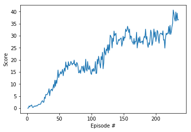

### Learning Algorithm

I'm using the DDPG algorithm to solve this problem. This choice is motivated by the fact that the action space is continous and DDPG has shown quite an impressive performance in past.

The network comprises of 2 networks.

- Actor: 128
- Critic: 128 -> 64 -> 32

Hyperparameters used are:

- replay buffer size = 5e5
- minibatch size = 512
- discount factor = 0.99
- tau for soft update of target parameters = 1e-3
- learning rate of the actor = 1e-3
- learning rate of the critic = 3e-3
- L2 weight decay = 0

### Plot of Rewards

A plot of rewards per episode is included to illustrate that:

- [version 2] the agent is able to receive an average reward (over 100 episodes, and over all 20 agents) of at least +30.

Number of episodes needed to solve the environment: 234

### Ideas for Future Work

- In future I would like to test the implementation using raw pixels. 
- Further, using PPO or A2C would be useful. 

